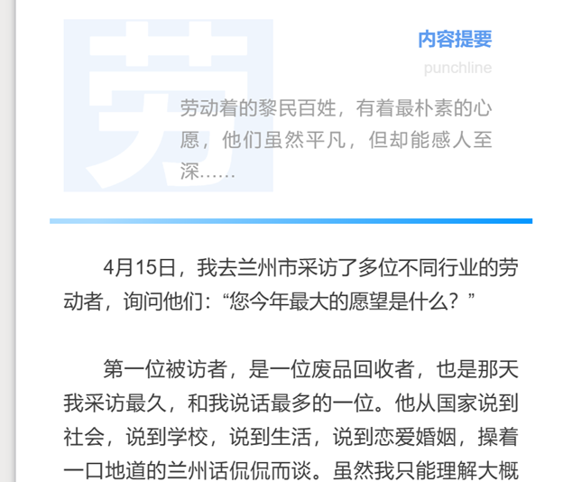

# 排版指导

> 鉴于当下日常推文排版屡次出错，版式不统一的问题。在此做一排版指导文档。今后专颗及原推文按出标准排版。

## 专题排版流程
### 1. 找到团队内专题模板打开，22级队友应都在2023闻鸣志No.1团队或2队，另存给自己，在“我的图文”里面进行编辑。

"另存一个图文"

### 2. 开头，此部分注意，#后是文章标题/每期话题/与文章相关的一句话，**需要加粗，16号字。**

  注意—— 排版内所有字体颜色无需更改变动，字间距，段落间距均为 0(专题原创都一样)

日期填推文推出的日期

注意图片是有讲究的，这一张图片要有提纲挈领之效，要能展示出文章的中心和关键，不能随便放一张图片上去。

(内容摘要：)加粗，后续文字无需加粗，**均为14号字。**

### 3.注意这个小组件，当你的文章特别有结构，每一部分都能够起一个漂亮的、总领的小标题的话，再用，反则不用。

用的话是这样的：

  （标题组件前后皆有一个行间距为1.0的空格，字号等则不用管）

不用的话是这样的：

  （中间无需空格）

### **4.**正文部分，是最关键的部分。我们继续往下看模板，能够发现有一个**框图版，**也有一个**无框图版的。**

  注意！以后专题文章正文内容，不再用无框图版，只用框图版！

那么如何把框图版最省时间，最方便地运用到自己排版里面，按我的步骤来。。

**按住shift键的同时，鼠标左键点击框图版的各个组件，一定一个都不要漏，然后点“收藏”。**

收藏之后看收藏栏，就有了完整的框图版组件，**这是第一步。**

然后鼠标左键点击框图版里面的图片模板，收藏，**这是第二步。**

**按住shift的同时，鼠标左键单击框图版里面的图片、下面的“新” 小标和后面的XXXXX,一定要全部选中，然后点击收藏，这是第三步。**

按sift同时点击专题模板中的滑动图片框，选中全部组件之后收藏，两个选一个就行。**这是最后一步。**

关于滑动图片框的使用，在这里特别提到：

这个组件你是可以自己增删图片的，不是说上面几张图你就只能或者
说必须得，放几张图上去，增删步骤如下：

滑动到最后一张图片，点击删除，然后点击白色部分。

会出现如上情况。 
(1)点击删除，可将多余的图片组件删除。 
(2)点击复制（黑色圆圈内），可以增加滑动序列中的图片。 
(3)复制后记得修改左上角图片序号。 
其他则无需调整。

  同时，一般图片超过两张（三张及以上）才考虑使用图片滑动框，若少于三张，使用这两个图片模板就行。

### 5.到这里，所有工作做完了，你就可以开始正式排版了

鼠标点击空行处，然后再点你收藏里面刚刚保存的模板，想用哪个点
哪个就行了。

比如我想在我的框里面多加一个图片，先插入一个空行，然后点收藏里的加就行了，加有图注的，还是没有的自己定，一般都需要有图注。

如图：

你的整个排版就是由一个又一个的框图模板组成的，**<u>就算不用那个标题组件，也不要整篇文章就在一个框里面，</u>** 要适当分框，分框时框和框之间的间隔前面讲过了。

正文字号15，行间距1.7，左右边距20，图片间要空行，段间要空行等等细节，则不再赘述。

还有一点，最后的。责编栏四个人，同时注意竖线左右皆有一个空格，人名之间也都是一个空格。

专题排版end:

原创:

**总之，排版是一个细活，要用心。**

## 原创排版流程

和上述专题流程大差不差。Shift十鼠标左键选中组件，收藏，使用。

注意开头：

**左边的字要是你右边那段话的第一个字，右边那段话字号为14，其余无需更改。**

如上图片所示，这个完了之后就直接开始正文了。和专题一样，如果你的正文很有结构，能分出来个一二三四，写出来小标题，就把这个用上。

如果没有，下面就直接接文字，**不需要框图。**

字号15，行距1.7，左右边距20，**原创需要首行缩进。**

至于图片模板，选择，收藏，即可使用，**就用这个版，统一一下，** 不要用其他的。

原创就说这么多······

### 日常推文之外的推文

意思就是除了日常我们推的专题和原创，大家有其他文章想要发在闻鸣志上的，**我们鼓励大家使用其他的模板来进行排版，** 不拘泥于我们
上面所要求的专题原创两个版。但是自们的日常推文还是按上述要求来。

**我们更加鼓励大家多发一些日常推文之外的文章，** 而不仅仅是完任务式的，只要你写了，就可以让组长责编审，老师也会细细地帮你看，
提供修改意见，就能发（不只是发在我们闻鸣志，如果文章写的漂亮，完全可以推到更好的平台来发)这是一个很好的学习过程。

比如你采访了某个人想写一篇专访，比如你进行了一次田野调查，比如你的一些闲言碎语，都是可以的，写好之后用自己喜欢的版来排，然后发出来。
